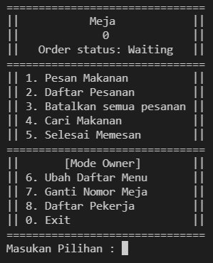
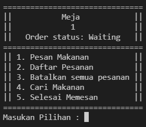
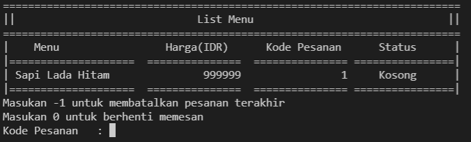
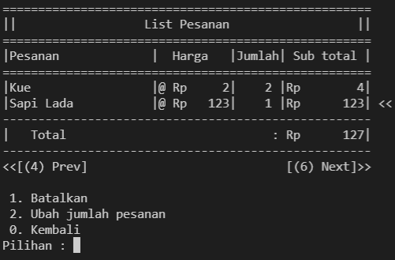

# WestoGram
CLI based restaurant cashier system

This is some of my earlier programming project using C, to graduate Algorithm and Data Structure course in college.

## Features

- User/Admin Modes
- CRUD
- Fully Working CLI Application

## Algorithm and Data Structures

- Doubly Linked List
- Binary Tree
- Sort Algorithm
- DFS

## Application Demo:

